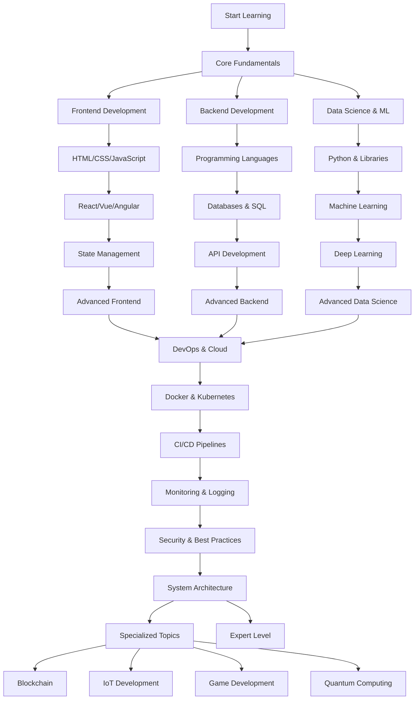

# Tech_notes

Status: In Progress
Progress Percentage: 100%
Field Progress: Beginner
Project Type: Writing
Skills Used: CSS, Git, HTML, JavaScript, Python, SQL
Growth Areas: Technical Skills
Project URL: https://github.com/Aryankatiyarcsjmu/MPpfolderp/tree/master
Auto Progress %: 0
Project Health: ⚪ Not Started

### Study Task Tracker

[Course Task Tracker](Tech_notes/Course%20Task%20Tracker%205c775a7cb07b4f24a1e6e99fe4c4c251.csv)

> Use this linked view to manage tasks from your notes. Add items, set due dates, and drag between statuses.
> 

---

## 🎯 Quick Navigation Hub

**Core Learning Pages:**

- [Java Tutorial](Tech_notes/Java%20Notes/Java%20Tutorial%20017b8ce63c53486a935245c3d125638c.md) - Structured Java learning path
- [Web_Dev Tutorial](Tech_notes/Web_Dev%20Tutorial%206ca55e5957e04bc3a3da78b95be35998.md) - HTML, CSS, JavaScript progression
- [Programming Notes: C, C++, Java, Python](https://www.notion.so/Programming-Notes-C-C-Java-Python-777c779d98d8478e9d02738390709017?pvs=21) - Multi-language reference

**Practice & Projects:**

- [Problem Solving + Badges Template (2025)](Personal%20Portfolio%20Website/Problem%20Solving%20+%20Badges%20Template%20(2025)%20177369f21c3f49ddaa993f19f53b4f31.md) - DSA tracking
- [Tech Project](Tech%20Project%20f515c83cfb6948d4bd2ad07f432592a0.md) - Current project work
- [Personal Portfolio Website](Personal%20Portfolio%20Website%2029c4084e7157807ba1e2d9a40ebd998c.md) - Portfolio development

**Workspace Tools:**

- [Scratchpad](https://www.notion.so/Scratchpad-2994084e715781dcbf30d3f6ac37ef7f?pvs=21) - Quick notes & ideas
- [E-commerce Dashboard](E-commerce%20Dashboard%2029c4084e715780e3b93fcce5c7c453ca.md) - Web presence links

---

## 🔥 Active Learning This Week

**Current Focus Areas (Mid-Nov 2025):**

- [ ]  Java fundamentals & syntax mastery
- [ ]  HTML/CSS basics and responsive design
- [ ]  Development environment setup and configuration
- [ ]  DSA problem-solving practice

**This Week's Goals:**

- [ ]  Complete Java Tutorial setup and first programs
- [ ]  Build first complete HTML/CSS page
- [ ]  Solve 3 DSA problems (targeting easy-medium difficulty)
- [ ]  Document solutions in LC_VC vault

**Recent Accomplishments:**

- ✅ Solved **19. Remove Nth Node From End of List** using two-pointer strategy
- ✅ Solved **2169. Count Operations to Obtain Zero** with Euclidean optimization
- ✅ Set up comprehensive Notion learning hub with 58 technology domains
- ✅ Created systematic task tracking system
- ✅ Organized Portfolio Projects database
- ✅ Started Data Visualization Study research project
- ✅ Built E-commerce Dashboard for local boutique (100% complete)
- ✅ Maintained 365-day LeetCode streak
- ✅ Earned 10 monthly badges and multiple competition badges

---

## 📚 Resources & Tools

**Learning Platforms:**

- [W3Schools](https://www.w3schools.com/) - Web development tutorials
- [LeetCode](https://leetcode.com/) - DSA practice
- [GitHub](https://github.com/) - Code repository

**Development Tools:**

- **IDE:** VS Code, IntelliJ IDEA
- **Version Control:** Git, GitHub
- **Design:** Figma, Adobe XD

**Documentation:**

- [MDN Web Docs](https://developer.mozilla.org/) - Web standards
- [Java Docs](https://docs.oracle.com/en/java/) - Java reference
- [Python Docs](https://docs.python.org/) - Python reference

---

## 💡 Project Ideas Bank

**Beginner Level:**

- [ ]  Personal portfolio website (HTML/CSS/JS)
- [ ]  Calculator app (JavaScript)
- [ ]  To-do list application (React basics)
- [ ]  Simple blog site (HTML/CSS)

**Intermediate Level:**

- [ ]  Weather app with API integration
- [ ]  E-commerce product page
- [ ]  Task management dashboard
- [ ]  Quiz application with scoring

**Advanced Level:**

- [ ]  Full-stack social media clone
- [ ]  Real-time chat application
- [ ]  Data visualization dashboard
- [ ]  Mobile app with React Native

**Practice Projects by Stack:**

- **Java:** Console banking system, library management
- **Web Dev:** Responsive landing page, interactive form
- **Database:** Student management system with CRUD
- **Full Stack:** Blog with authentication, REST API

---

## 📊 Learning Metrics Dashboard

**Progress Overview:**

- **Topics Started:** 5 / 58
- **Topics Completed:** 0 / 58
- **Current Streak:** 🔥 Track your daily progress!

**Time Investment:**

- **This Week:** *Track hours spent*
- **This Month:** *Track monthly total*
- **Total Learning Time:** *Lifetime learning hours*

**Skills Mastered:**

- [ ]  HTML Basics
- [ ]  CSS Fundamentals
- [ ]  JavaScript ES6
- [ ]  Java Core Concepts
- [ ]  Git & Version Control
- [ ]  Responsive Design
- [ ]  API Integration
- [ ]  Database Basics

**Next Milestones:**

- 🎯 Complete first project
- 🎯 Solve 50 DSA problems
- 🎯 Build portfolio website
- 🎯 Master one framework (React/Angular/Vue)

**Next Milestones:**

- 🎯 Complete first project
- 🎯 Solve 50 DSA problems
- 🎯 Build portfolio website
- 🎯 Master one framework (React/Angular/Vue)

---

## 🚀 Active Projects

[Untitled](Tech_notes/Untitled%20892e76e173ef4c5a9fb1c886a73f37c7.csv)

> Quick view of your projects currently in progress. Track what you're building and learning!
> 

---

---

[Topic Task Tracker](Tech_notes/Topic%20Task%20Tracker%20ae09987c68c748fab82186fe09de24a5.csv)

Brief placeholder for your portfolio entry tied to ongoing Java learning. You can add a description, skills used, and a completion date later. 

## Summary

- Comprehensive technology stack covering web development (HTML, CSS, JavaScript), frontend frameworks (React, Angular, Vue), and backend technologies (Java, PHP, Python, Node.js)
- Full-stack development capabilities including API integration, database management (SQL, MySQL, PostgreSQL, MongoDB), and modern frameworks
- Data science and AI proficiency with Python, NumPy, Pandas, and machine learning libraries (TensorFlow, PyTorch)
- Mobile development expertise in Kotlin, Swift, Java, and cross-platform frameworks (Flutter, React Native)
- Cloud and DevOps skills including Git, Docker, Kubernetes, and major cloud platforms (AWS, Azure, Google Cloud)
- Cybersecurity fundamentals with Python, SQL, and ethical hacking tools
- Programming foundation in multiple languages (C, C++, C#, Java, Python) and scripting automation (Bash, PowerShell)
- Active learning progress tracked through integrated task management system with course and topic trackers
- [ ]  Web Development Technology Stack
- 1. Web Development
    - [ ]  **Core:** HTML + CSS + JavaScript
    - [ ]  **Extras:** TypeScript, WebAssembly, GraphQL, WebSockets, Progressive Web Apps (PWA), Next.js, Nuxt.js
    - [ ]  **Tools:** Babel, Webpack, ESLint, PostCSS
- 2. Frontend Frameworks
    - [ ]  **Core:** React + Angular + Vue + Bootstrap
    - [ ]  **Extras:** Svelte, Ember.js, Alpine.js, Tailwind CSS
- 3. Backend Development
    - [ ]  **Core:** Java + PHP + Python + NodeJS
    - [ ]  **Frameworks:** Flask, Django, Express.js, Spring Boot, Ruby on Rails, .NET Core
    - [ ]  **Databases:** MySQL, PostgreSQL, MongoDB, Redis, Cassandra, Elasticsearch
- 4. Fullstack Development
    - [ ]  **Core:** Web Development + Backend Development
    - [ ]  **Includes:** APIs (REST, SOAP), Database integration
- 5. Database Management
    - [ ]  **Core:** SQL + MySQL + PostgreSQL + MongoDB
    - [ ]  **Extras:** Oracle, MariaDB, SQLite, CockroachDB, DynamoDB, Neo4j
- 6. Data Science and AI
    - [ ]  **Core:** Python + NumPy + Pandas + SciPy + AI + Data Science
    - [ ]  **Extras:** TensorFlow, PyTorch, Keras, OpenCV, Apache Spark, Hadoop, R, Julia, MATLAB
- 7. Mobile Development
    - [ ]  **Core:** Kotlin + Swift + Java
    - [ ]  **Extras:** Flutter (Dart), React Native, Xamarin
- 8. Cloud and DevOps
    - [ ]  **Core:** Git + Docker + Kubernetes
    - [ ]  **Extras:** Jenkins, Terraform, AWS, Azure, Google Cloud, Ansible, Puppet, Nagios
- 9. Cybersecurity
    - [ ]  **Core:** Cybersecurity fundamentals + Python + SQL
    - [ ]  **Extras:** Ethical hacking tools (Kali Linux, Metasploit), Cryptography, SIEM tools
- 10. Programming Fundamentals
    - [ ]  **Core:** C + C++ + C# + Java + Python
    - [ ]  **Extras:** Rust, Scala, Perl, Lua
- 11. Scripting and Automation
    - [ ]  **Core:** Bash + Python
    - [ ]  **Extras:** PowerShell, Perl, Ruby, Groovy
- 12. Modern Web Design
    - [ ]  **Core:** HTML + CSS + SASS + W3.CSS + Bootstrap
    - [ ]  **Focus:** Responsive, aesthetic UI/UX design
- 13. Interactive Web
    - [ ]  **Core:** JavaScript + jQuery + React + AngularJS
    - [ ]  **Purpose:** Dynamic and interactive client-side development
- 14. Game Development
    - [ ]  **Core:** Unity (C#) + Unreal Engine (C++) + Godot
    - [ ]  **Extras:** Pygame, Three.js, Phaser, Blender (3D modeling)
- 15. Blockchain and Web3
    - [ ]  **Core:** Solidity + Ethereum + Smart Contracts
    - [ ]  **Extras:** Web3.js, Truffle, Hardhat, IPFS, Polygon, Hyperledger
- 16. IoT and Embedded Systems
    - [ ]  **Core:** Arduino + Raspberry Pi + C/C++
    - [ ]  **Extras:** MQTT, ESP32/ESP8266, FreeRTOS, Embedded Linux, Microcontrollers (ARM, AVR)
- 17. Testing and Quality Assurance
    - [ ]  **Core:** Selenium + Jest + JUnit + PyTest
    - [ ]  **Extras:** Cypress, Mocha, Chai, TestNG, Postman, JMeter, Cucumber
- 18. API Development and Integration
    - [ ]  **Core:** REST APIs + GraphQL + Postman + Swagger
    - [ ]  **Extras:** gRPC, API Gateway, OAuth 2.0, JWT, WebSockets, Webhooks
- 19. Version Control and Collaboration
    - [ ]  **Core:** Git + GitHub + GitLab + Bitbucket
    - [ ]  **Extras:** SVN, Mercurial, Git Flow, Code Review tools, CI/CD pipelines
- 20. Emerging Technologies
    - [ ]  **Core:** AR/VR (Unity, Unreal), Quantum Computing basics, Edge Computing
    - [ ]  **Extras:** WebXR, ARCore, ARKit, Qiskit, 5G applications, Serverless Architecture
- 21. Low-Code/No-Code Platforms
    - [ ]  **Core:** Bubble, Webflow, OutSystems, Mendix
    - [ ]  **Extras:** Zapier, Airtable, Retool, AppGyver, Microsoft Power Platform
- 22. Data Engineering
    - [ ]  **Core:** Apache Spark + Hadoop + Kafka + Airflow
    - [ ]  **Extras:** Apache Flink, Apache Beam, Databricks, Snowflake, dbt, ETL/ELT pipelines
- 23. Design and Prototyping
    - [ ]  **Core:** Figma + Adobe XD + Sketch + InVision
    - [ ]  **Extras:** Framer, Principle, Marvel, Balsamiq, Zeplin, Adobe Creative Suite
- 24. Natural Language Processing (NLP)
    - [ ]  **Core:** spaCy + NLTK + Hugging Face Transformers + GPT APIs
    - [ ]  **Extras:** Stanford CoreNLP, Gensim, TextBlob, BERT, LangChain, OpenAI API, Anthropic Claude API
- 25. Computer Vision
    - [ ]  **Core:** OpenCV + TensorFlow + PyTorch + YOLO
    - [ ]  **Extras:** Detectron2, MediaPipe, scikit-image, Pillow, Dlib, OpenVINO, Image segmentation tools
- 28. Performance Optimization and Monitoring
    - [ ]  **Core:** Lighthouse + Chrome DevTools + New Relic + Datadog
    - [ ]  **Extras:** Grafana, Prometheus, AppDynamics, Dynatrace, Performance budgets, Lazy loading, Code splitting, CDN optimization
- 26. Robotics and Automation
    - [ ]  **Core:** ROS (Robot Operating System) + Python + C++
    - [ ]  **Extras:** ROS 2, Gazebo, V-REP, MATLAB Robotics Toolbox, OpenCV for robotics, Motion planning libraries
- 27. Software Architecture and Design Patterns
    - [ ]  **Core:** Microservices + MVC + MVVM + Repository Pattern
    - [ ]  **Extras:** Domain-Driven Design (DDD), SOLID principles, Clean Architecture, Event-Driven Architecture, CQRS, Saga Pattern, Hexagonal Architecture
- 29. Edge Computing and Fog Computing
    - [ ]  **Core:** Edge AI + AWS IoT Greengrass + Azure IoT Edge + Cloudflare Workers
    - [ ]  **Extras:** FogHorn, EdgeX Foundry, KubeEdge, OpenFog, Real-time data processing, Distributed computing frameworks
- 30. Quantum Computing
    - [ ]  **Core:** Qiskit + Cirq + Q# + Quantum algorithms
    - [ ]  **Extras:** IBM Quantum Experience, Amazon Braket, Google Quantum AI, PennyLane, QuTiP, Quantum machine learning, Shor's algorithm, Grover's algorithm
- 31. Containerization and Orchestration
    - [ ]  **Core:** Docker + Kubernetes + Docker Compose + Helm
    - [ ]  **Extras:** Podman, Rancher, OpenShift, Nomad, Container security, Service mesh (Istio, Linkerd), Container registries (Docker Hub, Harbor)
- 32. Serverless Architecture
    - [ ]  **Core:** AWS Lambda + Azure Functions + Google Cloud Functions + API Gateway
    - [ ]  **Extras:** Serverless Framework, AWS SAM, Cloudflare Workers, Vercel, Netlify Functions, Firebase Cloud Functions, Event-driven architecture, Function-as-a-Service (FaaS)
- 33. Augmented Reality (AR) and Virtual Reality (VR)
    - [ ]  **Core:** Unity + Unreal Engine + ARKit + ARCore + Vuforia
    - [ ]  **Extras:** WebXR, A-Frame, Oculus SDK, HTC Vive SDK, Magic Leap, Spatial computing, Hand tracking, 3D modeling (Blender, Maya)
- 34. Progressive Web Apps (PWA)
    - [ ]  **Core:** Service Workers + Web App Manifest + Workbox + PWA Builder
    - [ ]  **Extras:** Push Notifications API, Background Sync, IndexedDB, Cache API, Lighthouse PWA audit, Offline-first strategies, App Shell architecture
- 35. GraphQL and Modern API Technologies
    - [ ]  **Core:** GraphQL + Apollo Client + Apollo Server + Relay
    - [ ]  **Extras:** Hasura, Prisma, GraphQL Yoga, Subscriptions, Federation, Schema stitching, DataLoader, GraphQL Code Generator
- 36. Real-Time Communication
    - [ ]  **Core:** WebSockets + [Socket.io](http://Socket.io) + WebRTC + SignalR
    - [ ]  **Extras:** Pusher, Ably, PubNub, MQTT, Server-Sent Events (SSE), Redis Pub/Sub, Real-time collaboration tools, Video/audio streaming
- 37. Content Management Systems (CMS)
    - [ ]  **Core:** WordPress + Drupal + Joomla + Contentful + Strapi
    - [ ]  **Extras:** Ghost, Sanity, Prismic, Headless CMS, Netlify CMS, KeystoneJS, Directus, WordPress REST API, Custom theme development
- 38. E-Commerce Development
    - [ ]  **Core:** Shopify + WooCommerce + Magento + BigCommerce
    - [ ]  **Extras:** PrestaShop, OpenCart, Stripe integration, PayPal API, Payment gateways, Shopping cart development, Product catalogs, Inventory management systems
- 39. Search Engine Optimization (SEO) and Analytics
    - [ ]  **Core:** Google Analytics + Google Search Console + SEMrush + Ahrefs
    - [ ]  **Extras:** Moz, Screaming Frog, Yoast SEO, Schema markup, Meta tags optimization, Core Web Vitals, Sitemap generation, Robots.txt, Canonical URLs
- 40. Accessibility (A11y)
    - [ ]  **Core:** WCAG Guidelines + ARIA + axe DevTools + Lighthouse Accessibility
    - [ ]  **Extras:** Screen readers (NVDA, JAWS), Keyboard navigation, Color contrast checkers, Semantic HTML, Focus management, WAI-ARIA best practices, Inclusive design.
- 41. Cybersecurity and Ethical Hacking
    - [ ]  **Core:** Kali Linux + Metasploit + Wireshark + Burp Suite + OWASP Top 10
    - [ ]  **Extras:** Nmap, John the Ripper, Hashcat, Social engineering, Penetration testing, Security audits, Cryptography, Network security, Vulnerability assessment
- 42. Data Visualization and Business Intelligence
    - [ ]  **Core:** Tableau + Power BI + D3.js + Chart.js + Plotly
    - [ ]  **Extras:** Apache Superset, Looker, QlikView, Grafana dashboards, Matplotlib, Seaborn, Bokeh, Data storytelling, Interactive dashboards, KPI tracking.
- 43. Low-Level Programming and Systems Programming
    - [ ]  **Core:** C + C++ + Assembly + Operating Systems concepts + Memory management
    - [ ]  **Extras:** Rust, LLVM, GCC, Kernel development, Device drivers, Embedded systems, RTOS, Bare-metal programming, System calls, Linkers and loaders.
- 44. Game Development
    - [ ]  **Core:** Unity + Unreal Engine + C# + C++ + Game Design principles
    - [ ]  **Extras:** Godot, GameMaker Studio, Phaser, Three.js, PlayCanvas, 2D/3D graphics, Physics engines, Animation, AI for games, Multiplayer networking, Steam SDK, Game monetization.
- 45. API Management and Gateway Solutions
    - [ ]  **Core:** Kong + Apigee + AWS API Gateway + Azure API Management
    - [ ]  **Extras:** Tyk, MuleSoft, WSO2, API versioning, Rate limiting, API documentation, OAuth flows, API monetization, Traffic management, API analytics.
- 46. Internet of Things (IoT) Development
    - [ ]  **Core:** Arduino + Raspberry Pi + MQTT + Node-RED + AWS IoT Core
    - [ ]  **Extras:** ESP32/ESP8266, LoRaWAN, Zigbee, Bluetooth Low Energy (BLE), Azure IoT Hub, Google Cloud IoT, ThingSpeak, IoT security protocols, Sensor integration, Edge processing.
- 47. Web Assembly (WASM)
    - [ ]  **Core:** Emscripten + AssemblyScript + Rust for WASM + WASI
    - [ ]  **Extras:** Blazor WebAssembly, wasm-bindgen, wasm-pack, WASM runtimes (Wasmtime, Wasmer), Performance-critical web apps, Cross-platform compilation, WASM modules.
- 48. Microservices Communication Patterns
    - [ ]  **Core:** REST APIs + gRPC + Message Queues (RabbitMQ, Kafka) + Service Discovery
    - [ ]  **Extras:** Apache Thrift, GraphQL Federation, Event sourcing, Circuit breakers (Hystrix, Resilience4j), API Gateway patterns, Saga patterns, Distributed tracing (Jaeger, Zipkin), Service mesh communication.
- 49. API Security and Authentication
    - [ ]  **Core:** OAuth 2.0 + JWT + API Keys + OpenID Connect
    - [ ]  **Extras:** Auth0, Okta, Keycloak, SAML, Multi-factor authentication (MFA), Token refresh strategies, CORS policies, Rate limiting, API encryption (TLS/SSL), Security headers, HMAC signatures.
- 50. Static Site Generators and Jamstack
    - [ ]  **Core:** Next.js + Gatsby + Hugo + Jekyll + Eleventy
    - [ ]  **Extras:** Astro, Nuxt.js, Gridsome, Hexo, VuePress, Pelican, Markdown processing, Static hosting (Netlify, Vercel), Incremental Static Regeneration, Build optimization, Headless CMS integration.
- 51. Distributed Systems and Consensus Algorithms
    - [ ]  **Core:** Raft + Paxos + Apache ZooKeeper + etcd + Consul
    - [ ]  **Extras:** Distributed locks, Leader election, CAP theorem, BASE vs ACID, Vector clocks, Gossip protocols, Conflict resolution, Distributed transactions, Two-phase commit, Eventual consistency.
- 52. Streaming Data Processing
    - [ ]  **Core:** Apache Kafka + Apache Flink + Apache Storm + Kafka Streams
    - [ ]  **Extras:** Apache Pulsar, Amazon Kinesis, Azure Stream Analytics, Google Cloud Dataflow, RabbitMQ Streams, Stream processing patterns, Windowing functions, Stateful processing, Exactly-once semantics, Real-time ETL.
- 53. Web Performance and Optimization
    - [ ]  **Core:** Lighthouse + WebPageTest + Chrome DevTools Performance + Webpack Bundle Analyzer
    - [ ]  **Extras:** Critical CSS, Tree shaking, Code splitting, Image optimization (WebP, AVIF), Resource hints (preload, prefetch), Service Worker caching, HTTP/2 and HTTP/3, Brotli compression, Performance budgets, Lazy loading strategies.
- 54. API Design and RESTful Best Practices
    - [ ]  **Core:** REST principles + OpenAPI/Swagger + Postman + API versioning strategies
    - [ ]  **Extras:** HATEOAS, Richardson Maturity Model, API documentation tools (Redoc, Stoplight), Request/response design patterns, Error handling standards, Pagination strategies, Filtering and sorting, Idempotency, API deprecation policies.
- 55. Cloud-Native Development and CNCF Ecosystem
    - [ ]  **Core:** Kubernetes + Docker + Helm + Prometheus + Service Mesh (Istio/Linkerd)
    - [ ]  **Extras:** Fluentd, Envoy, CoreDNS, Argo CD, Tekton, Cloud Native Buildpacks, OPA (Open Policy Agent), Falco, SPIFFE/SPIRE, Cloud events, Multi-cluster management, GitOps workflows.
- 56. Quantum Computing and Quantum Programming
    - [ ]  **Core:** Qiskit + Cirq + Q# + Quantum gates + Quantum algorithms (Shor's, Grover's)
    - [ ]  **Extras:** PennyLane, ProjectQ, Quantum simulators, Quantum error correction, Quantum entanglement, Quantum cryptography, Variational Quantum Eigensolver (VQE), Quantum machine learning, IBM Quantum Experience, Azure Quantum.
- 57. Edge Computing and Content Delivery Networks
    - [ ]  **Core:** Cloudflare Workers + AWS CloudFront + Akamai + Fastly + CDN strategies
    - [ ]  **Extras:** Edge functions, Lambda@Edge, Cloudflare Pages, StackPath, CDN77, Geographic distribution, Cache invalidation, Origin shields, DDoS protection, Edge caching strategies, Content optimization at edge.
- 58. Blockchain and Smart Contract Development
    - [ ]  **Core:** Solidity + Ethereum + Web3.js + Truffle + Hardhat
    - [ ]  **Extras:** Remix IDE, Ganache, OpenZeppelin, MetaMask integration, ERC standards (ERC-20, ERC-721), Polygon, Binance Smart Chain, Chainlink oracles, IPFS, Decentralized applications (DApps), Gas optimization, Smart contract auditing.

### Linked Note

- [Java Tutorial](Tech_notes/Java%20Notes/Java%20Tutorial%20017b8ce63c53486a935245c3d125638c.md)

> Quick access to your Java tutorial note from this project.
> 

### HTML Tutorial Resources

- [Web_Dev Tutorial](Tech_notes/Web_Dev%20Tutorial%206ca55e5957e04bc3a3da78b95be35998.md)

> Complete HTML learning path with progress tracking and organized topics.
> 

# Tech Learning Roadmap

## Summary

- **Comprehensive technology learning resource:** Covers 58 major technology domains from fundamentals to advanced specializations
- **Core and extended skills:** Each domain includes essential core technologies plus supplementary tools and concepts for deeper mastery
- **Full-stack coverage:** Spans frontend, backend, databases, DevOps, cloud platforms, mobile development, and emerging technologies
- **Modern development practices:** Includes containerization, microservices, CI/CD, testing frameworks, and security best practices
- **Specialized fields:** Covers blockchain, IoT, quantum computing, game development, cybersecurity, and machine learning
- **Progressive learning path:** Organized roadmap from basics through advanced topics to expert-level specializations
- **Industry-relevant tools:** Features current frameworks, platforms, and technologies used in professional development
- **Linked resources:** Includes connections to Java and Web Development tutorials for hands-on learning

[1. Web Development - HTML, CSS, JavaScript](Tech_notes/1%20Web%20Development%20-%20HTML,%20CSS,%20JavaScript%200c21601d96854edca57a5f30b5a52e1d.md)

[2. Frontend Frameworks - React, Angular, Vue, Bootstrap](Tech_notes/2%20Frontend%20Frameworks%20-%20React,%20Angular,%20Vue,%20Boots%208ea00bf734ae41e18ae935744459faa2.md)

[3. Backend Development - Java, PHP, Python, Node.js](Tech_notes/3%20Backend%20Development%20-%20Java,%20PHP,%20Python,%20Node%20js%20e3e5c30f223e42569c28269217e93462.md)

[4. Database Management - SQL, MySQL, PostgreSQL, MongoDB](Tech_notes/4%20Database%20Management%20-%20SQL,%20MySQL,%20PostgreSQL,%20Mo%20b4f348abbb674d76831c038c9ebed8b5.md)

[5. Data Science & AI - Python, NumPy, Pandas, Machine Learning](Tech_notes/5%20Data%20Science%20&%20AI%20-%20Python,%20NumPy,%20Pandas,%20Machi%200f41c1e82e2a436b9dc07d166db898ab.md)

[6. Mobile Development - Kotlin, Swift, Java, Flutter](Tech_notes/6%20Mobile%20Development%20-%20Kotlin,%20Swift,%20Java,%20Flutte%206fa0f06f92924630bc3837b5c7f81844.md)

[7. Cloud & DevOps - Git, Docker, Kubernetes, AWS](Tech_notes/7%20Cloud%20&%20DevOps%20-%20Git,%20Docker,%20Kubernetes,%20AWS%202ba10a66a8e7478d860d36c06d023e9d.md)

[8. Cybersecurity - Fundamentals, Python, SQL](Tech_notes/8%20Cybersecurity%20-%20Fundamentals,%20Python,%20SQL%2057d89d90b39a4a518eee91ace8ac6b40.md)

[9. Programming Fundamentals - C, C++, C#, Java, Python etc.](Tech_notes/9%20Programming%20Fundamentals%20-%20C,%20C++,%20C#,%20Java,%20Pyt%20196737b172ce4ffea0550f1efc2c53c5.md)

[10. Scripting & Automation - Bash, Python, PowerShell](Tech_notes/10%20Scripting%20&%20Automation%20-%20Bash,%20Python,%20PowerShe%207dd70cbbb5b940759ff2bbf065804d7b.md)

[11. Modern Web Design - HTML, CSS, SASS, Bootstrap](Tech_notes/11%20Modern%20Web%20Design%20-%20HTML,%20CSS,%20SASS,%20Bootstrap%20cd8ffa5dc6c245d88ffccaf3debd7787.md)

[12. Interactive Web - JavaScript, jQuery, React, AngularJS](Tech_notes/12%20Interactive%20Web%20-%20JavaScript,%20jQuery,%20React,%20An%20a137a378ec0640fda4fa118537098cdb.md)

[13. Game Development - Unity, Unreal Engine, Godot](Tech_notes/13%20Game%20Development%20-%20Unity,%20Unreal%20Engine,%20Godot%20b7a46d5d1d9a456492e3952a9259382a.md)

[44. Game Development](Tech_notes/44%20Game%20Development%20bf893fe0348a4363b0868a4910d12c42.md)

[45. API Management & Gateway Solutions](Tech_notes/45%20API%20Management%20&%20Gateway%20Solutions%20c54760e12cc5454bb4866fe2b6355e72.md)

[14. Fullstack Development - Complete Stack Integration](Tech_notes/14%20Fullstack%20Development%20-%20Complete%20Stack%20Integrat%203ce0e18b7d58483eba16c89e406a5d63.md)

[15. Blockchain & Web3 - Decentralized Applications](Tech_notes/15%20Blockchain%20&%20Web3%20-%20Decentralized%20Applications%201300923dc8414384954966a00a0c0816.md)

[16. IoT & Embedded Systems - Connected Devices](Tech_notes/16%20IoT%20&%20Embedded%20Systems%20-%20Connected%20Devices%208373e98aa3ee4869afe2d3587c0e344a.md)

[17. Testing & QA - Quality Assurance](Tech_notes/17%20Testing%20&%20QA%20-%20Quality%20Assurance%2038e6525c8f4a4729bf435cbd37e58e66.md)

[18. API Development & Integration](Tech_notes/18%20API%20Development%20&%20Integration%209d8b21a138d1464da045b59c02f24846.md)

[19. Version Control & Collaboration](Tech_notes/19%20Version%20Control%20&%20Collaboration%20c0400f8293f2402cb2b5fe215ac660f4.md)

[20. Emerging Technologies - AR/VR & Quantum](Tech_notes/20%20Emerging%20Technologies%20-%20AR%20VR%20&%20Quantum%20d6ce8395751b46dc99285f6be70debc2.md)

[21. Low-Code/No-Code Platforms](Tech_notes/21%20Low-Code%20No-Code%20Platforms%201a547ca41a5e463d8b22660e6de46cd7.md)

[22. Data Engineering - Big Data Processing](Tech_notes/22%20Data%20Engineering%20-%20Big%20Data%20Processing%20209e1732d8844f01bdee2bdc8e05f711.md)

[23. Design & Prototyping - UI/UX Tools](Tech_notes/23%20Design%20&%20Prototyping%20-%20UI%20UX%20Tools%208ae29bede49a4511b681cff494b20c37.md)

[34. Progressive Web Apps (PWA)](Tech_notes/34%20Progressive%20Web%20Apps%20(PWA)%20654415d88d6846968e706d083b36c6c3.md)

[35. GraphQL & Modern API Technologies](Tech_notes/35%20GraphQL%20&%20Modern%20API%20Technologies%20171e8dddf055478e95ca7731c0093ba3.md)

[36. Real-Time Communication](Tech_notes/36%20Real-Time%20Communication%207a2abec2202848799bcc1cc88402ea68.md)

[37. Content Management Systems (CMS)](Tech_notes/37%20Content%20Management%20Systems%20(CMS)%2099a9c64c281043ecaf4b40c101280e53.md)

[38. E-Commerce Development](Tech_notes/38%20E-Commerce%20Development%20315beb34fdb04696a424606bc83fb555.md)

[39. SEO & Analytics](Tech_notes/39%20SEO%20&%20Analytics%205fd9b470b40543d0878e14864c8b2e27.md)

[40. Accessibility (A11y)](Tech_notes/40%20Accessibility%20(A11y)%20507d1d766b5c4d808dc3d16f9e4b1b5c.md)

[41. Cybersecurity & Ethical Hacking](Tech_notes/41%20Cybersecurity%20&%20Ethical%20Hacking%20bbcebef11026403dbac1ed995bf3d867.md)

[42. Data Visualization & Business Intelligence](Tech_notes/42%20Data%20Visualization%20&%20Business%20Intelligence%209da9a2481d1040dfab0e962ba9b13aef.md)

[43. Low-Level & Systems Programming](Tech_notes/43%20Low-Level%20&%20Systems%20Programming%20af9b044a30644328be77b80d2440c783.md)

[24. Natural Language Processing (NLP)](Tech_notes/24%20Natural%20Language%20Processing%20(NLP)%203ac944b1c87a4f5984d704d494063c72.md)

[25. Computer Vision](Tech_notes/25%20Computer%20Vision%20f8a65b8d7ef24731ba104ddfac46b4e9.md)

[26. Robotics & Automation](Tech_notes/26%20Robotics%20&%20Automation%201979e2174a9f46828596aec40083e65e.md)

[27. Software Architecture & Design Patterns](Tech_notes/27%20Software%20Architecture%20&%20Design%20Patterns%20315cc379ac4f4831bab2874d6c1c3a6d.md)

[28. Performance Optimization & Monitoring](Tech_notes/28%20Performance%20Optimization%20&%20Monitoring%203b7968653a064873b027cae185df3053.md)

[29. Edge Computing & Fog Computing](Tech_notes/29%20Edge%20Computing%20&%20Fog%20Computing%206f6479d04d7143ab9679881b28184bf6.md)

[30. Quantum Computing](Tech_notes/30%20Quantum%20Computing%20f4d4af055f684a1895577fc8b3d5a347.md)

[31. Containerization & Orchestration](Tech_notes/31%20Containerization%20&%20Orchestration%20cd0a891bb3514502aa7a12f6fbaf25d9.md)

[32. Serverless Architecture](Tech_notes/32%20Serverless%20Architecture%2044cf61a5813e404887c41cf754a9e1c7.md)

[33. AR & VR Development](Tech_notes/33%20AR%20&%20VR%20Development%20809c652c9a8a47779e1bc796058fb0b6.md)

[55. Cloud-Native Development & CNCF](Tech_notes/55%20Cloud-Native%20Development%20&%20CNCF%20ee1cedff395c41a4a8e88fc1b4a36629.md)

[56. Quantum Computing & Programming](Tech_notes/56%20Quantum%20Computing%20&%20Programming%20c5fb5fc578c84d7a96a1873c8042e22b.md)

[57. Edge Computing & CDN](Tech_notes/57%20Edge%20Computing%20&%20CDN%20adeaa8572f4448ea8fa372fa41c754fb.md)

[58. Blockchain & Smart Contracts](Tech_notes/58%20Blockchain%20&%20Smart%20Contracts%209180394c8e1948dbab8167561861f824.md)

[46. IoT Development - Connected Devices](Tech_notes/46%20IoT%20Development%20-%20Connected%20Devices%20d325905578084094be9bfa42334e1825.md)

[47. WebAssembly (WASM) - High Performance Web](Tech_notes/47%20WebAssembly%20(WASM)%20-%20High%20Performance%20Web%2022c9d9e601154f88be4cdcf99d7c1433.md)

[48. Microservices Communication Patterns](Tech_notes/48%20Microservices%20Communication%20Patterns%20bfe3843c587b41e6a339544b34b32217.md)

[49. API Security & Authentication](Tech_notes/49%20API%20Security%20&%20Authentication%20a469dd0df1614036b48f8c2c7c6b9e47.md)

[50. Static Site Generators & Jamstack](Tech_notes/50%20Static%20Site%20Generators%20&%20Jamstack%201c2e29fb69064f6bb82d7a716deb3b8d.md)

[51. Distributed Systems & Consensus Algorithms](Tech_notes/51%20Distributed%20Systems%20&%20Consensus%20Algorithms%209e45ba9f8550465c902d4d72c43b31bd.md)

[52. Streaming Data Processing](Tech_notes/52%20Streaming%20Data%20Processing%20e7d79f8c96f843aea6da823422f03ce3.md)

[53. Web Performance & Optimization](Tech_notes/53%20Web%20Performance%20&%20Optimization%20bcb3f3147bbc4d91940733c44d4bdd49.md)

[54. API Design & RESTful Best Practices](Tech_notes/54%20API%20Design%20&%20RESTful%20Best%20Practices%20e9e74ad09dda4538b8cbd5cf8fc7c685.md)

[Interview Question Incidents (LeetCode + Rounds)](Tech_notes/Interview%20Question%20Incidents%20(LeetCode%20+%20Rounds)%20191cdf7a3c1446658e22c275a73b22ce.csv)

[Web_Dev Tutorial](Tech_notes/Web_Dev%20Tutorial%206ca55e5957e04bc3a3da78b95be35998.md)

[Java Notes](Tech_notes/Java%20Notes%202a24084e715780d89549d96eb847ef7b.csv)